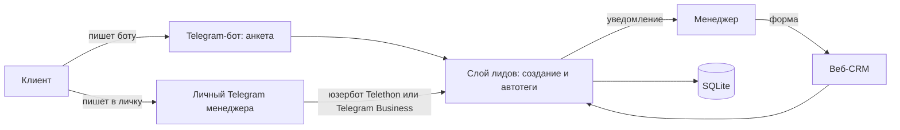

# Мини-CRM заявок для рекламного агентства: набросок продукта

## Проблема
Небольшое рекламное агентство продаёт таргет, Директ, SEO, SMM и сайты. Заявки приходят из трёх мест:
- бот или форма;
- личка менеджера в Telegram;
- звонки и рекомендации, которые менеджер держит в голове или в заметках.

Из-за этого заявки теряются, и никто не знает, сколько их было за неделю. Непонятно, на какие услуги спрос и какой канал приводит клиентов. Таблица в Google Sheets не спасает: заносить туда приходится руками, и это быстро перестают делать.

## Для кого
Агентство на 1–5 человек: владелец и пара менеджеров по продажам. Им не нужен amoCRM с воронками и ролями. Нужно одно место, куда все заявки падают сами, и способ быстро их разметить.

## Как это работает

1. **Бот.** Клиент нажимает /start и выбирает услугу кнопкой, затем пишет имя, контакт (кнопкой «Поделиться номером» или как @username) и задачу. Перед отправкой видит сводку. Лид сразу появляется в CRM с тегами `бот` и тегом услуги (`таргет`, `seo` и т. д.), а менеджеру в Telegram приходит уведомление со ссылкой на карточку.
2. **Личный Telegram.** Новый собеседник, написавший менеджеру в личку, становится лидом с тегом `личный tg`. Дальнейшая переписка в обе стороны видна в карточке. Если первым написал менеджер или собеседник есть в его контактах, лид не создаётся: это не заявки.
3. **Вручную.** Менеджер заводит лида формой (звонок, встреча). Лид получает тег `вручную` плюс любые свои теги.
4. **Теги.** Источник и услуга проставляются автоматически. Свои теги («горячий», «vip», «на паузе») менеджер добавляет и снимает в карточке. Клик по тегу показывает всех лидов с ним, рядом с каждым тегом видно число лидов.

## Что в MVP
- Бот-анкета, уведомление менеджеру, дополнения после заявки попадают в переписку лида.
- Веб-CRM за логином: список, поиск, фильтр по тегу, карточка (правка полей, теги, статус «новый / в работе / закрыт», переписка), ручное добавление.
- Личный Telegram через юзербота Telethon (не требует Premium). Альтернативный путь через Telegram Business уже в коде: его включает подключение бота в настройках Telegram Business, если есть Premium.
- Один процесс: веб, бот и юзербот вместе, SQLite в файле. Запуск одной командой или одним контейнером.

## Что сознательно за скобками
- **Воронка продаж, сделки, суммы, задачи и напоминания.** Это следующий шаг после того, как заявки перестанут теряться.
- **Ответ клиенту прямо из CRM.** Сейчас из карточки есть ссылка «Написать в Telegram».
- **Команда и роли**, распределение лидов между менеджерами. Сейчас один общий вход.
- **Склейка дублей.** Повторная заявка того же человека даёт новый лид, потому что правило склейки (по телефону? по tg id? за какой срок?) — продуктовое решение.
- **Другие каналы:** формы сайта, WhatsApp, звонки, импорт из таблиц, интеграция с amoCRM или Битрикс24.
- **Аналитика** по источникам и услугам, антиспам, медиа во входящих (сейчас берём только текст и подписи).

## Как сделан пункт 2 и почему так
Было два пути:
- **Telegram Business.** Владелец аккаунта в настройках подключает нашего бота как чат-бота, и Bot API присылает его личные входящие (`business_message`). Это официальный механизм: он не требует хранить доступ к аккаунту, и его можно отключить одной кнопкой. Минус в том, что нужен Telegram Premium.
- **Юзербот (Telethon, MTProto).** CRM входит в аккаунт по номеру телефона один раз и слушает личные чаты. Работает без Premium. Цена: строка сессии даёт полный доступ к аккаунту, её надо хранить как секрет. Это неофициальный клиент, поэтому при агрессивном использовании есть риск ограничений. Мы только читаем входящие и ничего не рассылаем.

В MVP работает юзербот, потому что Premium нет. Для продакшена я бы рекомендовал Business: он безопаснее и не зависит от сессии.
